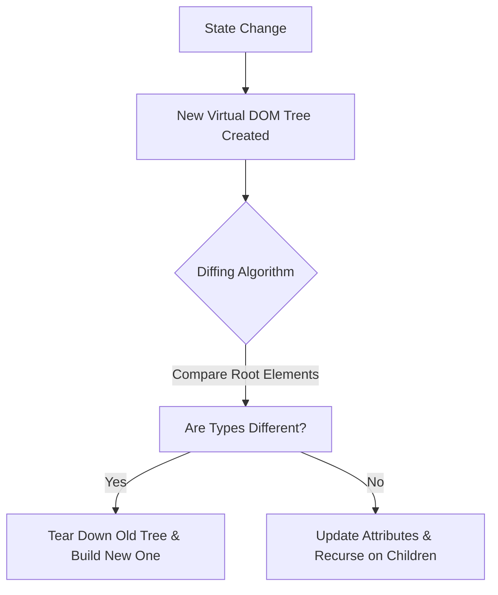
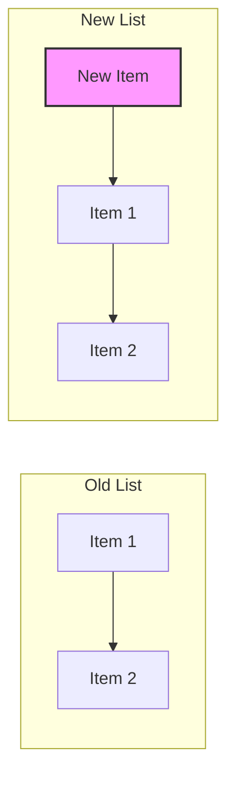

# Reconciliation & The Virtual DOM

## What is the Virtual DOM?

The Virtual DOM (VDOM) is a programming concept where an ideal, or "virtual", representation of a UI is kept in memory and synced with the "real" DOM by a library such as ReactDOM. This process is called **Reconciliation**.

In React, for every DOM object, there is a corresponding "virtual DOM object." A virtual DOM object is a representation of a DOM object, like a lightweight copy.

## The Reconciliation Process

React implements a heuristic O(n) algorithm based on two assumptions:
1. Two elements of different types will produce different trees.
2. The developer can hint at which child elements may be stable across different renders with a `key` prop.

### 1. The Diffing Algorithm

When the state of a component changes, React creates a new Virtual DOM tree. React then compares this new tree with the previous one to figure out exactly what has changed.



### 2. Different Element Types

If the root design elements have different types, React will tear down the old tree and build the new tree from scratch.

*   `<a>` to ``
*   `<Article>` to `<Comment>`
*   `<Button>` to `<div>`

**Consequence:** All state associated with the old tree is lost.

### 3. DOM Elements of the Same Type

When comparing two React DOM elements of the same type, React looks at the attributes of both, keeps the same underlying DOM node, and only updates the changed attributes.

```jsx
// Old
<div className="before" title="stuff" />

// New
<div className="after" title="stuff" />
```

Result: React modifies `className` on the underlying DOM node.

### 4. Recursing on Children

By default, when recursing on the children of a DOM node, React just iterates over both lists of children at the same time and generates a mutation whenever there's a difference.

**The Problem:**
If you insert an element at the *beginning* of a list, React may mutate every child instead of realizing it can keep the `<li>` nodes 2 and 3 intact.



### 5. Keys

To solve this, React supports a `key` attribute. When children have keys, React uses the keys to match children in the original tree with children in the subsequent tree.

```jsx
<ul>
  <li key="2015">Duke</li>
  <li key="2016">Villanova</li>
</ul>

<ul>
  <li key="2014">Connecticut</li> <!-- New item -->
  <li key="2015">Duke</li>
  <li key="2016">Villanova</li>
</ul>
```

Now React knows that the element with key `'2014'` is the new one, and the elements with the keys `'2015'` and `'2016'` have just moved.

## Re-renders: When and Why?

A "re-render" in React means calling the component function again to compute the new Virtual DOM description. It does **not** necessarily mean updating the actual browser DOM.

### Triggers for Re-render

1.  **State Change**: The most common cause. When `useState`, `useReducer`, or `useExternalStore` updates.
2.  **Parent Re-render**: If a parent component re-renders, all of its children re-render recursively (unless optimized with `React.memo`).
3.  **Context Change**: If a component consumes a Context provider, and that provider's value changes.
4.  **Hooks Changes**: Custom hooks that trigger state updates.

### Why "Week 1" Folder Structure?

We organize content by weeks to progressively build complexity.
*   **Week 1**: Focuses on **Mental Models** and **Fundamentals** (like this Virtual DOM concept). You cannot effectively optimize React without understanding *how* it decides to update the DOM.

> [!IMPORTANT]
> A re-render tells React *what the UI should look like now*. React then compares this with the previous result (Diffing) and applies only the necessary changes to the real DOM (Commit).
